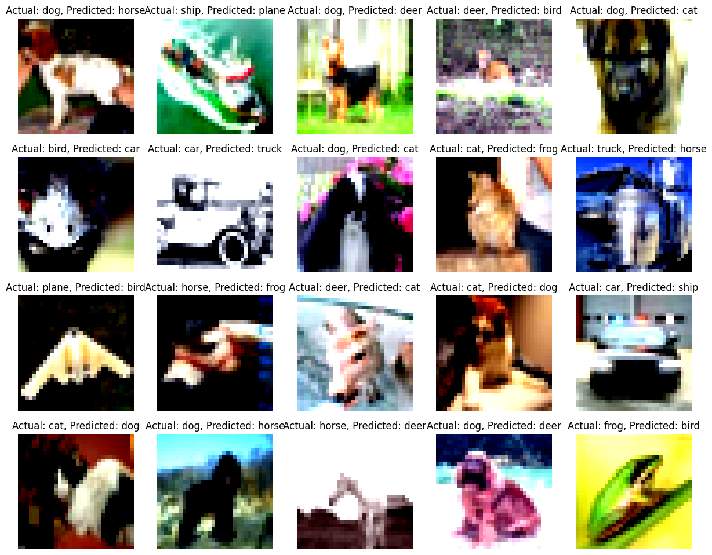
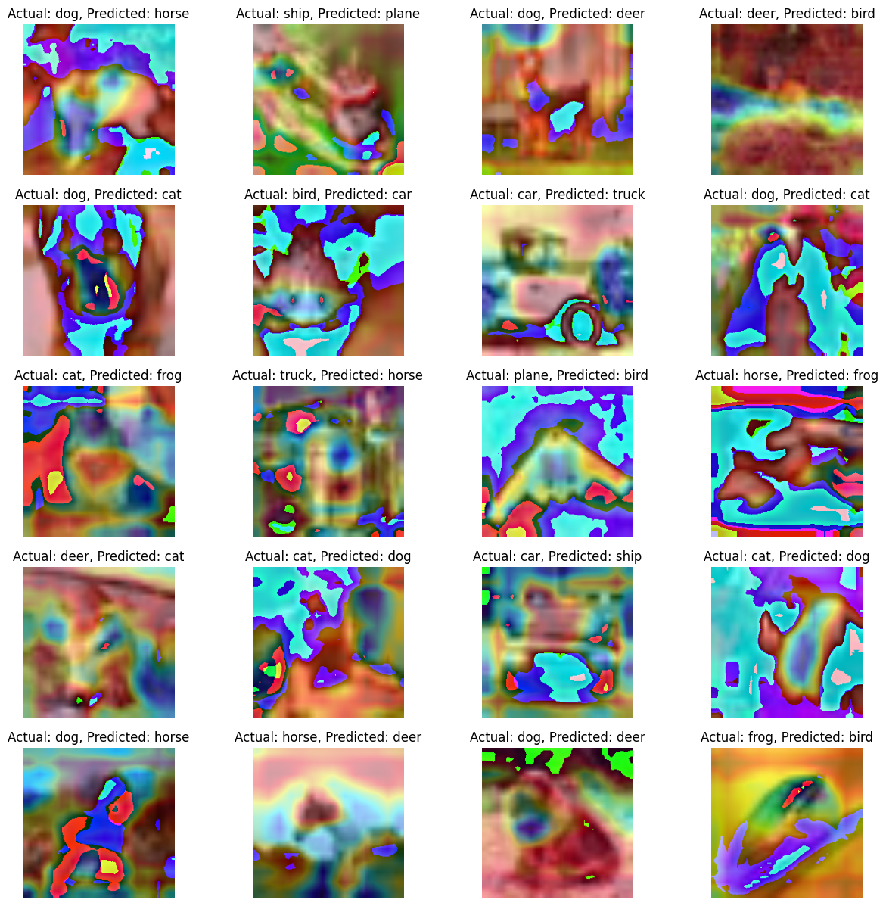

Session 11 Assignment
==========================

# Explanation

Create a proper folder structure for this deliverable
Models: Contains the main model file (Resnet18)
Data Transformations: This folder contains the module which will list down all transformation codes
Data Loader: This contains the code for Train and Test data loaders
Utils: This will contain
1.	The Train Test util: The Train and Test Code
2.	 Accuracy util: Holds the code for finding out validation Accuracy
3.	Gradcam Util : Help to perform gradcam on images
4.	misclassified_image_utils : Helps to find out misclassified images
5.	plot_metrics_utils : Helps to find out plots/charts for the model train and test parameters 
Main.py : Contains all the Code for loading
1.	Training 
2.	Model Parameters
3.	Model
4.	Training
5.	Loads incorrect label function and displays 

Constraints 
==============
1.	Train for 40 Epochs
2.	20 misclassified images
3.	20 GradCam output on the SAME misclassified images
4.	Apply these transforms while training:
1.	RandomCrop(32, padding=4)
2.	CutOut(16x16)
3.	Rotate(±5°)
5.	Must use ReduceLROnPlateau
6.	Must use LayerNormalization ONLY

Misclassified Images
=====================

Gradcam Images
=====================

Logs
=====================
EPOCH: 0

Loss=1.442049264907837 Batch_id=195 Accuracy=35.58: 100%|██████████| 196/196 [00:45<00:00,  4.33it/s]

Test set: Average loss: 1.5722, Accuracy: 4332/10000 (43.32%)

Test Accuracy: 43.32 has increased. Saving the model
EPOCH: 1

Loss=1.5338133573532104 Batch_id=195 Accuracy=45.90: 100%|██████████| 196/196 [00:45<00:00,  4.30it/s]

Test set: Average loss: 1.1325, Accuracy: 6038/10000 (60.38%)

Test Accuracy: 60.38 has increased. Saving the model
EPOCH: 2

Loss=1.3467878103256226 Batch_id=195 Accuracy=51.84: 100%|██████████| 196/196 [00:46<00:00,  4.21it/s]

Test set: Average loss: 1.1090, Accuracy: 6078/10000 (60.78%)

Test Accuracy: 60.78 has increased. Saving the model
EPOCH: 3

Loss=1.1652313470840454 Batch_id=195 Accuracy=55.89: 100%|██████████| 196/196 [00:45<00:00,  4.29it/s]

Test set: Average loss: 0.8931, Accuracy: 6912/10000 (69.12%)

Test Accuracy: 69.12 has increased. Saving the model
EPOCH: 4

Loss=1.0549232959747314 Batch_id=195 Accuracy=58.75: 100%|██████████| 196/196 [00:45<00:00,  4.33it/s]

Test set: Average loss: 0.7993, Accuracy: 7215/10000 (72.15%)

Test Accuracy: 72.15 has increased. Saving the model
EPOCH: 5

Loss=0.9877794981002808 Batch_id=195 Accuracy=61.04: 100%|██████████| 196/196 [00:45<00:00,  4.28it/s]

Test set: Average loss: 0.8585, Accuracy: 7030/10000 (70.30%)

EPOCH: 6

Loss=1.0950812101364136 Batch_id=195 Accuracy=62.98: 100%|██████████| 196/196 [00:46<00:00,  4.26it/s]

Test set: Average loss: 0.6751, Accuracy: 7682/10000 (76.82%)

Test Accuracy: 76.82 has increased. Saving the model
EPOCH: 7

Loss=0.8100839853286743 Batch_id=195 Accuracy=64.39: 100%|██████████| 196/196 [00:45<00:00,  4.35it/s]

Test set: Average loss: 0.7464, Accuracy: 7488/10000 (74.88%)

EPOCH: 8

Loss=1.0878289937973022 Batch_id=195 Accuracy=65.73: 100%|██████████| 196/196 [00:45<00:00,  4.33it/s]

Test set: Average loss: 0.6475, Accuracy: 7811/10000 (78.11%)

Test Accuracy: 78.11 has increased. Saving the model
EPOCH: 9

Loss=0.9211626052856445 Batch_id=195 Accuracy=66.62: 100%|██████████| 196/196 [00:46<00:00,  4.22it/s]

Test set: Average loss: 0.6562, Accuracy: 7787/10000 (77.87%)

EPOCH: 10

Loss=1.0333921909332275 Batch_id=195 Accuracy=67.92: 100%|██████████| 196/196 [00:45<00:00,  4.32it/s]

Test set: Average loss: 0.6162, Accuracy: 7911/10000 (79.11%)

Test Accuracy: 79.11 has increased. Saving the model
EPOCH: 11

Loss=0.6622820496559143 Batch_id=195 Accuracy=69.14: 100%|██████████| 196/196 [00:45<00:00,  4.31it/s]

Test set: Average loss: 0.5690, Accuracy: 8072/10000 (80.72%)

Test Accuracy: 80.72 has increased. Saving the model
EPOCH: 12

Loss=0.7159744501113892 Batch_id=195 Accuracy=69.62: 100%|██████████| 196/196 [00:45<00:00,  4.28it/s]

Test set: Average loss: 0.5500, Accuracy: 8112/10000 (81.12%)

Test Accuracy: 81.12 has increased. Saving the model
EPOCH: 13

Loss=0.6568178534507751 Batch_id=195 Accuracy=70.31: 100%|██████████| 196/196 [00:46<00:00,  4.25it/s]

Test set: Average loss: 0.5527, Accuracy: 8134/10000 (81.34%)

Test Accuracy: 81.34 has increased. Saving the model
EPOCH: 14

Loss=0.8263927698135376 Batch_id=195 Accuracy=70.83: 100%|██████████| 196/196 [00:45<00:00,  4.28it/s]

Test set: Average loss: 0.6382, Accuracy: 7899/10000 (78.99%)

EPOCH: 15

Loss=1.0794854164123535 Batch_id=195 Accuracy=71.72: 100%|██████████| 196/196 [00:45<00:00,  4.28it/s]

Test set: Average loss: 0.5565, Accuracy: 8193/10000 (81.93%)

Test Accuracy: 81.93 has increased. Saving the model
EPOCH: 16

Loss=0.9456732869148254 Batch_id=195 Accuracy=72.22: 100%|██████████| 196/196 [00:45<00:00,  4.26it/s]

Test set: Average loss: 0.5133, Accuracy: 8294/10000 (82.94%)

Test Accuracy: 82.94 has increased. Saving the model
EPOCH: 17

Loss=0.6797829866409302 Batch_id=195 Accuracy=72.24: 100%|██████████| 196/196 [00:45<00:00,  4.31it/s]

Test set: Average loss: 0.5412, Accuracy: 8268/10000 (82.68%)

EPOCH: 18

Loss=1.014331579208374 Batch_id=195 Accuracy=73.57: 100%|██████████| 196/196 [00:45<00:00,  4.32it/s]

Test set: Average loss: 0.4725, Accuracy: 8427/10000 (84.27%)

Test Accuracy: 84.27 has increased. Saving the model
EPOCH: 19

Loss=0.7022676467895508 Batch_id=195 Accuracy=73.59: 100%|██████████| 196/196 [00:45<00:00,  4.31it/s]

Test set: Average loss: 0.4599, Accuracy: 8450/10000 (84.50%)

Test Accuracy: 84.5 has increased. Saving the model

